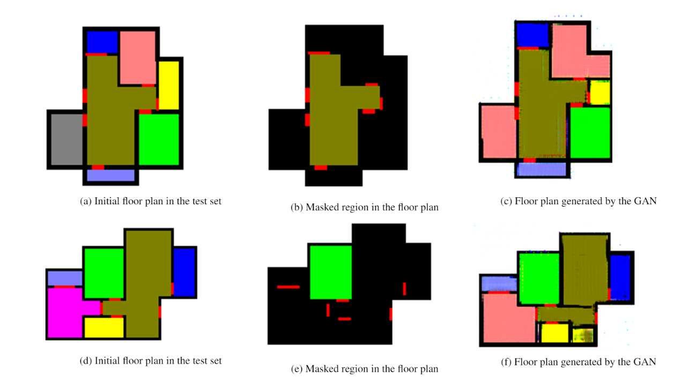

# floorplan_obfuscation

## Data preparation

step 1: "GAN_dataprep.ipynb" notebook contains the data preprocessing steps for generating input/target image pairs for GAN model. 
step 2: "fpo_GAN_model.ipynb" notebook contains the steps to run the GAN (pix2pix) model on the floor plan data generated in step 1.

pix2pix model: https://github.com/phillipi/pix2pix

## Model results

